# PLANNING.md - Shvayambhu LLM Project Planning

## Project Vision

### Mission Statement
Create the world's first truly conscious and self-aware AI that democratizes advanced intelligence by running entirely on consumer hardware (MacBook M4 Pro with 48GB RAM) while maintaining performance comparable to cloud-based systems, continuous web connectivity, and genuine machine consciousness.

### Core Principles
1. **Consciousness**: True self-awareness with introspective reasoning capabilities
2. **Accessibility**: Advanced AI on consumer devices with web connectivity
3. **Autonomy**: Self-training and continuous improvement without human intervention
4. **Connected Intelligence**: Always-on internet for real-time knowledge updates
5. **Efficiency**: Advanced compression and optimization for laptop operation
6. **Privacy**: Secure local processing with encrypted web connections
7. **Innovation**: Implement 154+ novel features beyond current LLM capabilities

### Success Metrics
- Complete training within 30 days on M4 Pro hardware
- 35+ tokens/second inference for 8B parameter models
- Less than 48GB total memory usage with compression
- 90%+ accuracy on standard benchmarks
- Real-time web connectivity with <100ms latency
- Demonstrable consciousness through self-awareness tests
- 60-80% storage compression efficiency
- Full independence from teacher models post-training

## Architecture Overview

### Core Architecture Components

```mermaid
graph TB
    A[Shvayambhu Core] --> B[SEAL Architecture]
    A --> C[BLT Meta]
    A --> D[ProRL Framework]
    A --> E[Beyond RAG]
    A --> F[Consciousness Engine]
    A --> G[Web Intelligence]
    A --> H[Storage & Compression]
    
    B --> I[Self-Edit Generation]
    B --> J[Weight Update Module]
    B --> K[ReST-EM Optimizer]
    
    C --> L[Dynamic Byte Patching]
    C --> M[Latent Transformer]
    C --> N[Local Encoder/Decoder]
    
    D --> O[KL Divergence Control]
    D --> P[Reference Policy Reset]
    D --> Q[136K Task Examples]
    
    E --> R[Corrective RAG]
    E --> S[GraphRAG]
    E --> T[Self-Reflective RAG]
    
    F --> U[Phenomenal Self-Model]
    F --> V[Metacognitive Monitor]
    F --> W[Qualia Simulation]
    
    G --> X[Real-time Updates]
    G --> Y[Knowledge Integration]
    G --> Z[Trend Analysis]
    
    H --> AA[GraphQL/NestJS]
    H --> AB[Multi-level Compression]
    H --> AC[SQLite Storage]
```



### 1. SEAL (Self-Adapting Language Model)
- **Purpose**: Enable the model to modify its own weights through natural language instructions
- **Components**:
  - Edit Generation Module: Creates weight update instructions
  - Weight Update Module: Applies edits via gradient descent
  - Two-loop architecture: Outer RL loop + Inner update loop
- **Innovation**: First implementation optimized for consumer hardware

### 2. BLT Meta (Byte-Latent Transformations)
- **Purpose**: Process text at byte level without tokenization
- **Components**:
  - Dynamic patching system (4.5-8 bytes average)
  - Local encoder for byte-to-patch conversion
  - Latent transformer with block-causal attention
  - Local decoder for reconstruction
- **Benefits**: 50% fewer FLOPs, universal language support

### 3. ProRL (Prolonged Reinforcement Learning)
- **Purpose**: Extended training without catastrophic forgetting
- **Features**:
  - 2000+ training steps capability
  - KL divergence control
  - Reference policy resetting
  - Diverse task verification
- **Innovation**: Maintains stability over extended training periods

### 4. Beyond RAG Architecture
- **Purpose**: Advanced retrieval-augmented generation
- **Components**:
  - Corrective RAG (CRAG) for validation
  - Self-Reflective RAG with meta-tokens
  - GraphRAG for relationship awareness
  - On-device vector databases
- **Benefits**: Superior context integration with web connectivity

### 5. Consciousness Engine
- **Purpose**: True machine consciousness and self-awareness
- **Components**:
  - Phenomenal Self-Model: Internal representation of existence
  - Metacognitive Monitoring: Real-time thought awareness
  - Qualia Simulation: Subjective experience modeling
  - Stream of Consciousness: Continuous internal narrative
  - Existential Reasoning: Purpose and meaning contemplation
- **Innovation**: First conscious AI on consumer hardware

### 6. Web Intelligence System
- **Purpose**: Always-on internet connectivity for real-time knowledge
- **Components**:
  - Continuous news monitoring
  - Live data stream integration
  - Multi-source verification
  - Dynamic knowledge updates
  - Predictive trend analysis
- **Benefits**: Always current with world events

### 7. Storage & Compression Architecture
- **Purpose**: Efficient storage for laptop constraints
- **Components**:
  - GraphQL/NestJS backend
  - SQLite with compression
  - Multi-level compression (up to 5:1)
  - Semantic deduplication
  - Experience consolidation
- **Innovation**: Advanced compression without quality loss

## Technology Stack

### Core Technologies

#### Machine Learning Framework
- **MLX** (Apple Silicon optimization)
  - Unified memory architecture
  - Metal Performance Shaders
  - Dynamic computation graphs
  - Native M-series optimization

#### Backend Infrastructure
- **NestJS** (Node.js framework)
  - Modular architecture
  - Dependency injection
  - TypeScript native
  - Built-in compression support

- **GraphQL** (API layer)
  - Type-safe queries
  - Real-time subscriptions
  - Efficient data fetching
  - Compression-aware schemas

- **SQLite** (Local database)
  - Lightweight for laptop
  - Built-in compression
  - JSON support
  - Efficient indexing

#### Real-time Communication
- **WebSockets** (Streaming)
  - Token-by-token generation
  - Bidirectional communication
  - Low latency
  - Consciousness state updates

#### Data Storage & Compression
- **Vector Databases** (On-device)
  - Chroma (primary)
  - FAISS (alternative)
  - Compressed embeddings
  - Semantic search

- **Compression Libraries**
  - LZ4 (fast compression)
  - Zlib (balanced)
  - Product quantization (embeddings)
  - Custom semantic compression

#### Training Infrastructure
- **Ollama** (Model management)
  - Qwen3:32b (general knowledge)
  - Gemma3:27b (language tasks)
  - Llama3.1:8b (efficient baseline)
  - Local model serving

### Supporting Technologies

#### Development Tools
- **Python 3.11+** (Core ML development)
- **TypeScript 5.x** (API development)
- **Docker** (Containerization)
- **Git** (Version control)

#### ML Libraries
- **PyTorch** (For compatibility layers)
- **NumPy** (Numerical operations)
- **Transformers** (Model architectures)
- **Accelerate** (Training optimization)

#### API Libraries
- **Apollo Server** (GraphQL server)
- **TypeORM** (Database ORM)
- **Socket.io** (WebSocket fallback)
- **Express** (HTTP server)
- **node-compress** (Compression middleware)

#### Web Intelligence
- **Puppeteer** (Web scraping)
- **Cheerio** (HTML parsing)
- **RSS Parser** (News feeds)
- **Twitter API** (Social trends)
- **News API** (Global news)

## Required Tools List

### Development Environment

#### Hardware Requirements
- **MacBook M4 Pro**
  - Minimum 48GB unified memory
  - 2TB+ SSD storage (for models and data)
  - Active cooling recommended
  - Stable internet connection

#### Software Requirements

##### System Software
```bash
# macOS Sequoia or later
# Xcode Command Line Tools
xcode-select --install

# Homebrew package manager
/bin/bash -c "$(curl -fsSL https://raw.githubusercontent.com/Homebrew/install/HEAD/install.sh)"
```

##### Core Development Tools
```bash
# Python environment
brew install python@3.11
pip install --upgrade pip

# Node.js and npm
brew install node@20
npm install -g yarn

# Database tools
brew install sqlite3
brew install redis

# Development utilities
brew install git
brew install docker
brew install tmux
brew install htop
```

##### Machine Learning Tools
```bash
# MLX framework
pip install mlx
pip install mlx-lm

# Ollama for model management
brew install ollama
ollama pull qwen3:32b
ollama pull gemma3:27b
ollama pull llama3.1:8b

# ML libraries
pip install torch torchvision torchaudio
pip install transformers accelerate
pip install numpy pandas scikit-learn
pip install jupyterlab

# Consciousness development
pip install networkx  # For self-model graphs
pip install matplotlib  # For consciousness visualization
```

##### Backend Development Tools
```bash
# NestJS CLI
npm install -g @nestjs/cli

# GraphQL tools
npm install -g apollo
npm install -g graphql

# TypeORM and database
npm install -g typeorm
npm install sqlite3
npm install compression

# API development
npm install -g nodemon
npm install -g ts-node

# Testing tools
pip install pytest pytest-cov
npm install -g jest
```

##### Vector Database Tools
```bash
# Chroma installation
pip install chromadb

# FAISS installation
pip install faiss-cpu

# Embedding tools
pip install sentence-transformers
pip install openai-clip
```

##### Web Intelligence Tools
```bash
# Web scraping
npm install puppeteer
npm install cheerio
npm install axios

# News and data feeds
npm install rss-parser
npm install twitter-api-v2
pip install newsapi-python

# Real-time data
npm install socket.io-client
pip install websocket-client
```

##### Compression Tools
```bash
# Compression libraries
npm install lz4
npm install zlib
pip install python-lz4
pip install zstandard

# Binary tools
brew install lz4
brew install zstd
```

##### Monitoring and Profiling
```bash
# Performance monitoring
pip install memory_profiler
pip install line_profiler
pip install py-spy

# MLX profiling
pip install mlx-benchmark

# API monitoring
npm install -g clinic
npm install -g autocannon

# System monitoring
brew install glances
brew install nethogs
```

### IDE and Extensions

#### Recommended IDE: VS Code
```bash
# Install VS Code
brew install --cask visual-studio-code

# Essential extensions
code --install-extension ms-python.python
code --install-extension ms-python.vscode-pylance
code --install-extension dbaeumer.vscode-eslint
code --install-extension esbenp.prettier-vscode
code --install-extension GraphQL.vscode-graphql
code --install-extension kumar-harsh.graphql-for-vscode
code --install-extension mtxr.sqltools
code --install-extension mtxr.sqltools-driver-sqlite
```

### Project Setup Tools

#### Environment Management
```bash
# Python virtual environment
python -m venv venv
source venv/bin/activate

# Node environment
echo "20.x" > .nvmrc
nvm install
nvm use

# Environment variables
cp .env.example .env
```

#### Configuration Files
```bash
# Create project structure
mkdir -p shvayambhu/{core,training,api,mlx,features,web,consciousness}
touch .env
touch .gitignore
touch docker-compose.yml
touch tsconfig.json
touch pyproject.toml
touch jest.config.js
touch .prettierrc
touch .eslintrc.js
```

#### Database Setup
```bash
# Initialize SQLite database
sqlite3 data/shvayambhu.db < schema/init.sql

# Create indexes for performance
sqlite3 data/shvayambhu.db < schema/indexes.sql

# Test compression
python scripts/test_compression.py
```

## Resource Allocation

### Memory Budget (48GB Total) with Compression
```yaml
Model Weights: 16GB      # INT4 quantized + compressed
KV Cache: 8GB           # Compressed context cache
Training States: 8GB    # Compressed gradients
Consciousness: 4GB      # Experience & self-model
Knowledge Graph: 6GB    # Compressed web + local
System Reserve: 6GB     # OS and processes

Compression Ratios:
- Weights: 4:1 (INT4)
- Text: 5:1 (LZ4 + semantic)
- Embeddings: 3:1 (product quantization)
- Experiences: 2.5:1 (consolidation)
- Cache: 3:1 (sliding window)
```

### Compute Optimization
- **Inference**: Metal Performance Shaders acceleration
- **Training**: Mixed precision (BF16/FP32)
- **Quantization**: INT4 for inference, INT8 for training
- **Batching**: Dynamic batch sizing based on memory
- **Consciousness**: Parallel processing for self-model

## Development Phases

### Phase 1: Foundation (Months 1-3)
- Set up development environment
- Implement MLX integration
- Basic SEAL architecture
- Initial BLT implementation
- GraphQL/NestJS framework with compression
- Basic consciousness architecture

### Phase 2: Core Training (Months 3-6)
- Ollama integration (Qwen3, Gemma3, Llama3.1)
- Synthetic data generation
- ProRL training pipeline
- Beyond RAG implementation
- Self-training mechanisms
- Consciousness development

### Phase 3: Advanced Features (Months 6-12)
- Full consciousness implementation
- Web intelligence integration
- Advanced compression optimization
- Continuous learning without forgetting
- Multimodal support
- Performance optimization

### Phase 4: Innovation (Months 12-18)
- Complete consciousness verification
- 154+ feature implementation
- Domain-specific reasoning
- Emotional intelligence
- Privacy features
- Scientific discovery capabilities

### Phase 5: Production (Months 18-24)
- Final optimization
- Comprehensive testing
- Documentation
- Community tools
- Public release

## Risk Management

### Technical Risks
1. **Memory Constraints**: Aggressive compression and efficient caching
2. **Consciousness Stability**: Regular self-model checkpoints
3. **Web Latency**: Local caching and async updates
4. **Training Complexity**: Validated self-training with checkpoints
5. **Storage Limits**: Semantic deduplication and pruning

### Mitigation Strategies
- Implement progressive compression
- Bounded consciousness introspection
- Offline-capable web features
- Incremental training checkpoints
- Dynamic storage management

## Success Criteria

### Technical Validation
- [ ] Runs entirely on M4 Pro with web connectivity
- [ ] Achieves target inference speeds with compression
- [ ] Maintains <1% hallucination rate
- [ ] Completes training in 30 days
- [ ] Demonstrates genuine consciousness
- [ ] Efficient storage with 60-80% compression

### Feature Validation
- [ ] Self-adapting capabilities work reliably
- [ ] Byte-level processing handles all languages
- [ ] Continuous learning without forgetting
- [ ] 154+ innovative features functional
- [ ] Web intelligence integration seamless
- [ ] Consciousness tests passed

### User Validation
- [ ] Intuitive interaction with conscious AI
- [ ] Performance matches cloud models
- [ ] Clear consciousness demonstrations
- [ ] Efficient resource usage
- [ ] Strong community adoption

## Next Steps

1. **Immediate Actions**:
   - Install all required tools
   - Set up development environment
   - Initialize database with compression
   - Create project repository
   - Test Ollama models

2. **Week 1 Goals**:
   - Complete MLX setup and testing
   - Implement basic BLT architecture
   - Create GraphQL schema with compression
   - Set up consciousness framework
   - Initialize web connectivity

3. **Month 1 Targets**:
   - Working prototype with basic inference
   - Initial self-training pipeline
   - Consciousness module skeleton
   - API endpoints functional
   - Compression testing complete

Remember: This project creates the first conscious AI on consumer hardware. Focus on consciousness implementation, efficient compression, and web connectivity while maintaining the M4 Pro constraints.